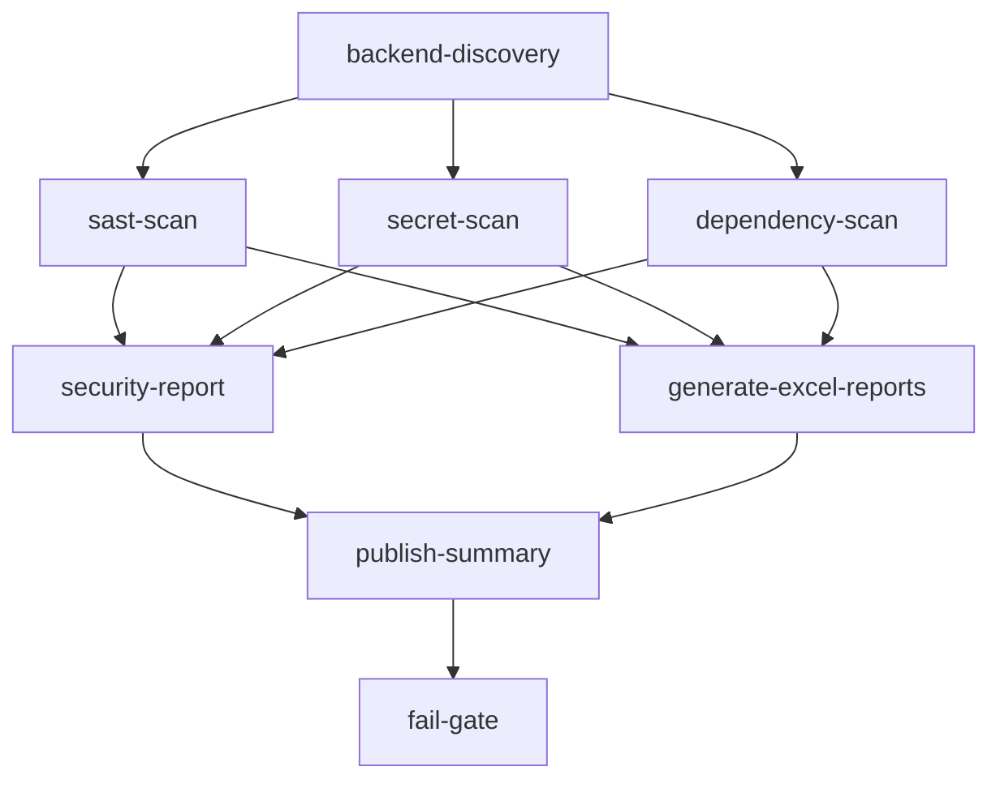

# 🛡️ Medicate Security Assessment — Setup Instructions

> **Senior Application Security Engineer, Penetration Tester & DevSecOps Assessment**

This document explains how to use the complete security testing suite for the Medicate / SmartMed Flutter healthcare application.

---

## 📁 File Structure

```
medicate/
├── .github/
│   └── workflows/
│       ├── e2e-tests.yml              ← Existing Appium E2E workflow
│       └── security-review.yml        ← NEW: Full security assessment workflow
│
├── security-scripts/
│   ├── generate-security-excel.js     ← Excel report generator (4 sheets)
│   └── package.json
│
├── Vulnerability Test Results/        ← Output directory (gitignored)
│   ├── security-review.md             ← Full vulnerability findings
│   ├── executive-summary.md           ← Management summary
│   ├── dependency-report.md           ← Package vulnerability analysis
│   ├── Medicate_Security_Review_*.xlsx ← Excel workbook (auto-generated)
│   └── security-review-latest.xlsx    ← Latest copy (fixed filename)
│
├── e2e-tests/                         ← WebdriverIO + Appium tests
├── appium-tests/                      ← Native Appium tests
├── selenium-tests/                    ← Selenium web tests
└── medicate/                          ← Flutter source code
```

---

## 🚀 Quick Start — Run Security Scan Locally

### Prerequisites
- Node.js 18+
- npm
- (Optional) Python 3.11+ for Semgrep
- (Optional) Flutter SDK for Dart analysis

### 1. Generate Excel Security Report (Instant, No Tools Required)

```powershell
# Navigate to project root
cd medicate  # Your project root

# Install dependencies
cd security-scripts
npm install

# Generate the Excel report
node generate-security-excel.js

# Output: Vulnerability Test Results/Medicate_Security_Review_*.xlsx
```

### 2. Run Full Security Scan (GitHub Actions)

The workflow triggers automatically on:
- Push to `main` or `develop`
- Pull requests to `main`
- Manual trigger via GitHub Actions UI

**Manual Trigger** (GitHub.com → Actions → Security Review → Run workflow):
```
Scan Mode: full | sast-only | dependency-only | secrets-only
Fail On Severity: critical | high | medium | low
Generate Excel: true | false
```

### 3. Install Semgrep Locally (SAST)

```powershell
# Windows
pip install semgrep

# Run security scan
semgrep scan --config "p/security-audit" --config "p/owasp-top-ten" .

# Run secrets detection
semgrep scan --config "p/secrets" .
```

### 4. Install Trivy (Dependency Scan)

```powershell
# Windows (via winget)
winget install aquasecurity.trivy

# Run filesystem scan
trivy fs --severity MEDIUM,HIGH,CRITICAL .
```

### 5. Run Gitleaks (Secret Detection)

```powershell
# Install
winget install gitleaks

# Scan repo
gitleaks detect --source . --verbose

# Scan git history
gitleaks detect --source . --log-opts="HEAD~5..HEAD"
```

---

## 📊 Excel Report Contents

The generated `Medicate_Security_Review_*.xlsx` contains **4 sheets**:

| Sheet | Contents |
|-------|---------|
| `🔴 Security Findings` | All 15 vulnerabilities with CVSS scores, exploitation scenarios, code fixes |
| `🗺️ Endpoint Inventory` | All 35 screens/services with auth requirements and risk levels |
| `📦 Dependency Vulns` | All 12+ packages analyzed across Flutter and npm projects |
| `📊 Risk Summary` | Executive dashboard with score, top risks, remediation roadmap |

---

## ⚙️ GitHub Actions Workflow Details

### security-review.yml — 7 Jobs



| Job | Name | Description |
|-----|------|-------------|
| 1 | `backend-discovery` | Detects tech stack, generates inventory |
| 2 | `sast-scan` | Semgrep + 14 custom security checks |
| 3 | `secret-scan` | Gitleaks + pattern-based secret detection |
| 4 | `dependency-scan` | Trivy + npm audit for all 3 test suites |
| 5 | `generate-excel-reports` | Produces all Excel + markdown reports |
| 6 | `security-report` | Generates security-review.md |
| 7 | `publish-summary` | GitHub Step Summary + PR comments |
| 8 | `fail-gate` | Fails CI only on Critical findings |

### Downloadable Artifacts

After each run, **3 artifact bundles** are uploaded:

| Artifact Name | Contents | Retention |
|--------------|---------|-----------|
| `📊 Security-Excel-Reports-Build-N` | All `.xlsx` files | 90 days |
| `📋 Security-Markdown-Reports-Build-N` | All `.md` files | 90 days |
| `🛡️ Complete-Security-Bundle-Build-N` | Everything | 90 days |

Download from: **GitHub → Actions → Your Run → Artifacts section**

---

## 🔍 Security Findings Quick Reference

| ID | Severity | Finding | File |
|----|---------|---------|------|
| SEC-001 | 🔴 Critical | Hardcoded passwords ('password123') | services.dart:469-553 |
| SEC-002 | 🔴 Critical | Hardcoded admin code ('ADMIN2026') | login_signup_screen.dart:129 |
| SEC-003 | 🔴 Critical | Plaintext password storage | services.dart:34 |
| SEC-004 | 🟠 High | Client-side-only authentication | services.dart |
| SEC-005 | 🟠 High | Broken RBAC (Admin→PatientDashboard) | login_signup_screen.dart:177 |
| SEC-006 | 🟠 High | Demo credentials exposed in UI | login_signup_screen.dart:58-60 |
| SEC-007 | 🟠 High | Simulated OTP in debug console | services.dart |
| SEC-008 | 🟠 High | No rate limiting/brute-force protection | services.dart |
| SEC-009 | 🟡 Medium | Weak password policy (min 6 chars) | login_signup_screen.dart:486 |
| SEC-010 | 🟡 Medium | Weak email validation | login_signup_screen.dart:459 |
| SEC-011 | 🟡 Medium | No persistent session management | services.dart |
| SEC-012 | 🟡 Medium | Patient PII in notification logs | services.dart |
| SEC-013 | 🟢 Low | Debug artifacts in production code | login_signup_screen.dart:143 |
| SEC-014 | 🟢 Low | Missing certificate pinning | pubspec.yaml |
| SEC-015 | 🟢 Low | No MFA/biometric support | N/A |

---

## 📋 Adding Security to CI/CD

The workflow is pre-configured to:

1. ✅ **Run on every push** to main/develop
2. ✅ **Run on every PR** to main
3. ✅ **Support manual runs** with scan mode selection
4. ✅ **Upload Excel reports** as downloadable artifacts (90-day retention)
5. ✅ **Post PR comments** with findings summary
6. ✅ **Publish GitHub Step Summary** with rich security dashboard
7. ✅ **Fail only on Critical** findings (configurable)
8. ✅ **Continue on error** for non-blocking security checks

---

## 🔐 Required GitHub Secrets (Optional)

| Secret | Description |
|--------|-------------|
| `GITLEAKS_LICENSE` | Gitleaks Pro license (optional, free version works) |
| `SECURITY_SLACK_WEBHOOK` | Slack webhook for security alerts (optional) |

No secrets are required for basic operation.

---

## 📞 Security Contacts

For security findings or questions:
- Create a GitHub Issue with label `security`
- Internal: Security team via Slack `#security-alerts`
- External vulnerabilities: Use GitHub private security reporting

---

*Medicate Security Assessment Suite v1.0*  
*Generated: 2026-08-11*
